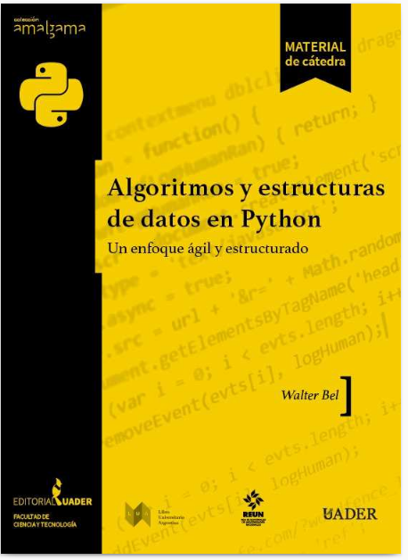

# Proyecto
- Este repositorio son una serie de ejercicios resueltos del libro llamado **Algoritmos y estructura de datos en Python** y su proposito es tener un respaldo de esos ejercicios en mi repositorio. 

# Datos extra
- Nombre: Fernando Octavio Arroyo Velasco.
- Nombre del libro: Algoritmos y estructura de datos en Python.
- Autor del libro: Walter bel.

# Imagen del libro

